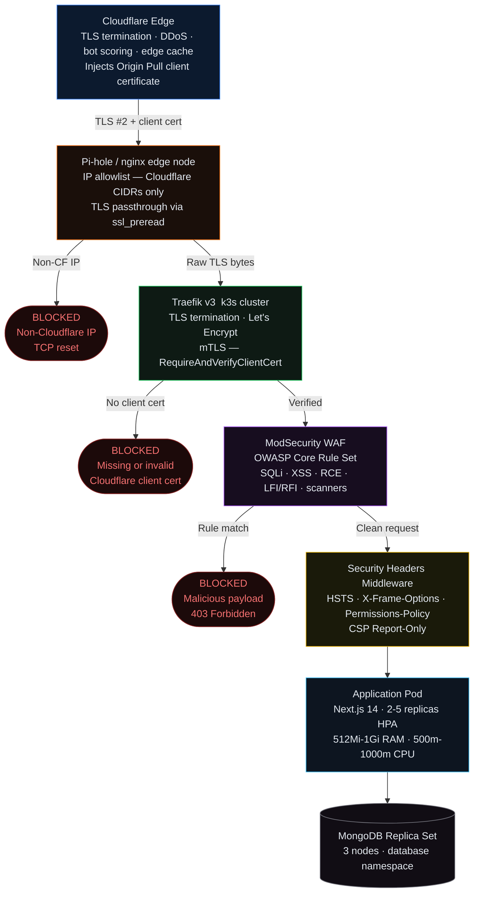

Throughout my career I've designed and operated enterprise production infrastructure at scale. I've built platforms that other engineers build products on top of. I know how that work feels on large instances with managed control planes and operations teams behind you. At some point that familiarity started to bother me.

The real learning in infrastructure comes from failure. In enterprise environments, failure is professionally costly — you design rigorously to prevent it, and when it happens it is treated as an incident, not a curriculum. Managed cloud services are deliberately abstracted so that most classes of failure never surface to the engineers running workloads on top of them. You become skilled at the interfaces, not the substrates.

I was holding a Raspberry Pi 5 and thinking about this when the project took shape. The question wasn't whether I could build something that worked. The question was whether the reliability and security patterns I'd applied at enterprise scale would hold on hardware constrained enough to actually teach me something new. What breaks when you have four ARM64 nodes with no cloud-managed storage, no elastic scaling, no operations team, and the control plane lives on a $75 single-board computer on a shelf in your office?

This is that project.

## The Architecture Decision

I started with a K3s cluster — one control plane node, three workers — all Raspberry Pi 5s running Debian Bookworm on NVMe storage attached via USB-C. K3s rather than full Kubernetes because K3s is designed for exactly this constraint: low memory overhead, single-binary install, sensible defaults for edge and embedded deployments. The etcd backing the control plane lives on the same node — a minimal footprint by design. I want to understand what control plane failure looks like, not avoid it.

The cluster sits on a dedicated server VLAN isolated from the rest of the home network. MetalLB handles the LoadBalancer service type, assigning Traefik a single static IP. A separate Raspberry Pi running Pi-hole serves double duty: DNS resolver for the entire network and the external-facing edge node that fronts the cluster.

That VLAN boundary does more than segment traffic — it also protects the cluster from the rest of my home network, which is full of hardware I cannot meaningfully secure. Smart doorbells, voice assistants, gaming consoles, and connected appliances all run proprietary firmware that I have no visibility into and no legal path to audit or modify. The DMCA prohibits circumventing the access controls and DRM embedded in consumer device firmware. Manufacturers enforce this further through cryptographically signed update chains and secure boot implementations that make unauthorized modification technically infeasible even where it might otherwise be legal. These devices receive security updates on the manufacturer's schedule — not mine — and some stop receiving updates entirely while still in active use. A compromised device on the same flat network as a production database is a serious risk regardless of how well the database itself is secured. The VLAN ensures that a supply chain compromise in a smart home device, or a vulnerability in a gaming console's network stack, has no lateral path to the cluster. The server VLAN trusts nothing from the home LAN, and the home LAN has no route into it.

The workload running on top of this is my personal website and a production web application, both receiving real public traffic. That was intentional. Synthetic workloads don't exercise a system the way real traffic does — especially the bot traffic, scanner probes, and credential harvesting attempts that arrive within hours of a public hostname going live.

## The Security Architecture

This is the part of the build I'm most proud of, and the part that best demonstrates how enterprise security thinking translates to constrained environments.

The attack surface of a home server is not small. The moment you open port 443 to the internet, you are receiving traffic from automated scanners, vulnerability probers, and credential stuffers continuously. This is not theoretical — I can see it in the ModSecurity audit logs. The question is not whether attacks arrive, but at what layer they are stopped.

I designed a layered defense-in-depth architecture with five distinct enforcement points. Each layer provides a different guarantee, and each is necessary because no single layer is sufficient.

**Layer 0 — Cloudflare Edge:** All public DNS records are Cloudflare-proxied. Cloudflare terminates TLS from the browser, applies DDoS protection and bot scoring at the edge, and forwards requests to my origin over a second TLS connection that carries a Cloudflare Origin Pull client certificate. Critically, the home router's public IP is never in DNS — clients connect to Cloudflare IPs, and Cloudflare connects to me. This means a significant portion of automated attacks never reach my hardware at all.

**Layer 1 — Pi-hole nginx IP Allowlist:** The home router forwards ports 80 and 443 to the Pi-hole node. Pi-hole runs nginx in stream mode, and the first thing that public stream block does is check the source IP against a hardcoded allowlist of every Cloudflare CIDR range — 15 IPv4 ranges and 7 IPv6 ranges. Any TCP connection from a non-Cloudflare source IP is reset before TLS even begins. There is no banner, no error page, no handshake. The connection simply fails. This is the enforcement point for direct origin bypass attempts.

nginx then uses `ssl_preread` to extract the SNI hostname from the TLS ClientHello without terminating TLS. The raw encrypted bytes are forwarded to the k3s cluster unmodified. Pi-hole is not reading the content of the connection — it is acting as a TCP relay with an IP filter in front of it.

**Layer 2 — Traefik mTLS:** Traefik terminates TLS using Let's Encrypt certificates and enforces mutual TLS via a `TLSOption` custom resource configured with `RequireAndVerifyClientCert` against the Cloudflare Origin Pull CA. Every incoming connection must present a valid Cloudflare-issued client certificate. Without it, the TLS handshake fails with a 525.

This is the cryptographic guarantee. Layer 1 can theoretically be circumvented by an attacker on a path that shares a Cloudflare CIDR. Layer 2 cannot be circumvented without the Cloudflare CA private key, which Cloudflare does not publish. These two layers in combination — IP allowlist plus mTLS certificate validation — close the direct origin bypass attack surface with a high degree of confidence.

**Layer 3 — ModSecurity WAF:** ModSecurity runs as a separate Deployment inside the cluster, using the `owasp/modsecurity-crs:nginx` image. Traefik's ModSecurity plugin middleware proxies each request through it before forwarding to the application. The OWASP Core Rule Set covers SQL injection, XSS, remote code execution, local and remote file inclusion, command injection, session fixation, and automated scanner detection.

Running ModSecurity as a separate pod — not a sidecar or inline module — was a deliberate architectural choice. It makes the WAF independently deployable and independently observable. It also introduces the most interesting operational challenge I've encountered: application-specific rule tuning. The OWASP CRS, applied without customization to a Next.js application with OAuth flows and JSON APIs, generates a steady stream of false positives. OAuth redirect parameters trigger injection rules. JSON request bodies with numeric strings trigger SQL injection rules. Next.js static asset paths confuse scanner detection rules.

Working through these false positives was genuinely instructive. In enterprise environments, WAF tuning is typically handled by a dedicated security team with institutional knowledge about what the application does. Here it was me, reading ModSecurity audit logs, understanding exactly which rule fired and why, and writing path-specific exceptions. The process forced a level of familiarity with the CRS rule set that I wouldn't have developed any other way.

**Layer 4 — Security Headers:** A Traefik Middleware CRD injects response headers on every outbound response: `Strict-Transport-Security` with preload and includeSubDomains, `X-Frame-Options: DENY`, `X-Content-Type-Options: nosniff`, a comprehensive `Permissions-Policy` that disables 15 browser APIs the application doesn't use, and a `Content-Security-Policy-Report-Only` header that logs violations to an API endpoint for monitoring without blocking legitimate requests while the policy is being refined.

The complete chain — Cloudflare edge → IP allowlist → mTLS → OWASP CRS → security headers — means that a request reaching the application pod has passed five independent enforcement points. This is defense-in-depth in the literal sense: no single layer's failure compromises the system.

## Observability as a First-Class Concern

I've seen infrastructure teams treat observability as an afterthought — something you add after the system is working. I've also seen what happens during an incident when logs aren't available or metrics were never collected. The observability stack here was planned from the start, not bolted on.

The stack is PLG: Promtail, Loki, and Grafana, with Prometheus for metrics. Promtail runs as a DaemonSet on every node, shipping pod logs to Loki via label-based discovery — any pod with the right labels is automatically collected with no per-application configuration. Prometheus scrapes metrics from the cluster components and application endpoints.

The ModSecurity WAF gets special treatment: because its audit logs are written to a file path inside the container rather than stdout, a Promtail sidecar shares an `emptyDir` volume with the ModSecurity pod and tails the audit log directly. Without this, WAF block events would be invisible in Grafana. This is a small operational detail, but it's exactly the kind of thing that gets missed when observability is not a first-class concern.

Grafana and the Prometheus/Loki endpoints are VPN-only. They have no public DNS records and are explicitly routed to a dead port in the Pi-hole nginx stream block for any public connection attempt. The observability plane does not touch the public internet.

## Storage, State, and the Constraints of ARM64

Longhorn provides distributed block storage across the cluster nodes. This was one of the more consequential architectural decisions because storage on USB-attached NVMe — even fast NVMe — behaves differently than cloud-managed block storage. Latency characteristics are different. IOPS limits are real and visible. Longhorn's replication adds overhead. For the MongoDB replica set running on this cluster, the replication configuration and read/write concern settings had to account for actual observed latency, not cloud-provider SLA assumptions.

The MongoDB replica set runs three nodes in the `database` namespace. The connection string uses all three replica members for both reads and writes. Development machine access goes through the same VPN and internal routing infrastructure as the rest of the cluster — another piece of plumbing that doesn't exist in managed database services and that required understanding the full network path to configure correctly.

ARM64 architecture was a constant constraint in the early weeks. Not every container image publishes multi-architecture manifests. Some popular images still ship only `linux/amd64`. Running into a `exec format error` at pod startup is a straightforward diagnosis, but it blocked progress until I either found an ARM64-compatible alternative or built the image myself from source. This is invisible in cloud environments where x86-64 nodes are the default assumption.

## The Application Tier

The production workload is a Next.js 14 application running with 2 replicas minimum, scaling to 5 via HPA. The HPA is configured against both CPU utilization and a custom RPS metric via prometheus-adapter — tuned to the actual CPU capacity of the Raspberry Pi nodes, which is roughly 24 RPS per pod at 70% CPU. Those numbers came from load testing, not from cloud provider benchmarks. This is the kind of calibration that only happens when you're responsible for the hardware.

The application image is stored in a private Docker registry running inside the cluster, accessible only over Tailscale. The blog content is stored on a Longhorn RWX PVC mounted at runtime rather than baked into the image. Blog posts can be updated without a deployment. The deploy pipeline — build, push, helm upgrade, Cloudflare cache purge — runs as a local script that produces a complete deployment in under two minutes.

## What I've Learned That Enterprise Environments Don't Teach

The failure modes here are different. When a Raspberry Pi node gets hot and throttles under sustained load, there is no alert from a cloud provider — you learn to monitor CPU frequency, not just CPU utilization. When an SD card fails (and they do fail), the recovery path depends entirely on how well you designed for it before it happened. When the control plane node loses power, you discover whether your etcd state is consistent and whether your workers can continue serving traffic during a brief control plane outage.

The WAF false positive tuning exercise was the most directly transferable learning. Understanding exactly which OWASP CRS rules fire on which request patterns, writing precise path-scoped exceptions, and validating that exceptions don't create unintended bypass paths — this is knowledge that a security team applying a vendor WAF at enterprise scale would find directly useful.

The other learning is the cost of every abstraction. Managed Kubernetes hides etcd, hides the control plane node, hides storage provisioning, hides certificate rotation. Each of those things is hidden because operating it correctly is non-trivial. Running them yourself reveals exactly what managed services are managing on your behalf — and builds the intuition to evaluate managed service trade-offs from a position of understanding rather than assumption.

This project is deliberately never done. It is the infrastructure I operate, the platform I deploy real workloads to, and the environment where I am intentionally running toward the failure modes that enterprise platforms are designed to route around.
